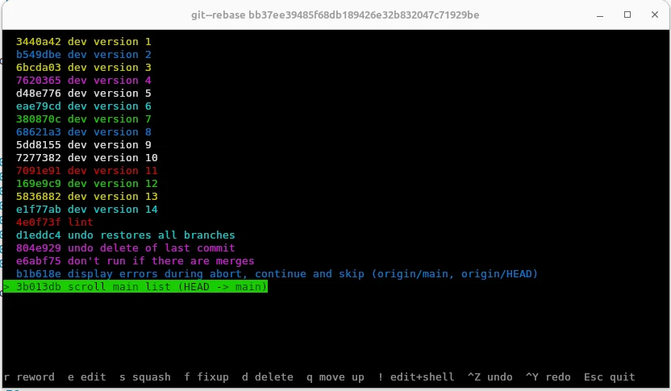

# Actually Interactive Rebase

`git rebase -i` hands you a text file, and you only find out what your edits did once you save it. `git--rebase` is a terminal UI where every keypress is a real rebase, carried out straight away. You watch the history change, and anything you don't like is one Ctrl-Z away.



## Features

- **Instant feedback.** Each action (reorder, squash, fixup, reword, edit, delete) runs a rebase straight away.
- **Undo / redo.** Ctrl-Z and Ctrl-Y step back and forth through every change, including cursor position.
- **Branches come along.** Other local branches that point into the range are shown in the list and updated with `update-ref`, so stacked branches stay stacked.
- **Stable colours.** Each commit is coloured by its subject line, so you can follow it as it moves around.
- **Conflict handling.** When a rebase stops, you see the conflicting commit's diff. Resolve it here or in another terminal, then continue, skip or abort.

## Install

Put `git--rebase` somewhere on your `PATH`. It needs Python 3 with `curses`, and Git 2.38 or newer.

## Usage

```
git--rebase <base>
```

This lists the commits in `<base>..HEAD`. It refuses to start if the working tree has uncommitted changes, a rebase is already in progress, `<base>` isn't an ancestor of `HEAD`, or the range contains merge commits.

### Keys

| Key       | Action                                       |
| --------- | -------------------------------------------- |
| ↑ / ↓     | Move the cursor                              |
| `q` / `a` | Move the commit up / down                    |
| `s`       | Squash into the commit above                 |
| `f`       | Fixup into the commit above                  |
| `r`       | Reword                                       |
| `e`       | Edit (stop at this commit)                   |
| `!`       | Edit, and drop straight into a shell         |
| `d`       | Delete                                       |
| Ctrl-Z    | Undo                                         |
| Ctrl-Y    | Redo                                         |
| Esc       | Quit                                         |

When the rebase pauses on a conflict or an edit:

| Key   | Action                  |
| ----- | ----------------------- |
| `c`   | `git rebase --continue` |
| `s`   | `git rebase --skip`     |
| `!`   | Open a shell            |
| ↑ / ↓ | Scroll the diff         |
| Esc   | `git rebase --abort`    |

## License

See [LICENSE](LICENSE).
